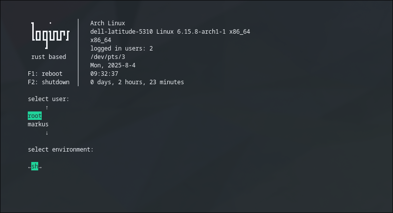

# loginrs
- tui login manager (display manager) written in rust using crossterm crate
- uses pam and is init system agnostic
- runs directly on the tty without a graphic stack
- supports UTF-8 characters for different languages and background ascii art
- this requires the console font to also support the chars used in the background
- instruction for making own console fonts provided below
## showcase
the default layout looks like this:


- sessions and user menus are freely placeable around the screen
- the background text can be changed to show boxes or exciting ascii art 
- F1 and F2 shortcuts to reboot / shutdown are hardcoded and only available when no session is active

All config files are created when first started with sufficient write rights (normally root) in `/etc/loginrs/`
```tree
.
├── config.toml --> Main config. Controls the behaviour
├── issue --> background
└── sessions.toml --> the session that are listed
```
When a config file is removed, it gets auto regenerated on the next execution. As long as a config file is present, the present config is used 
(so session can be changed in the toml file to only contain necessary entries)

## compile
- navigate to the folder loginrs is located and run cargo build with release profile
```sh
    
$ cd ./loginrs
$ cargo build --profile release
```
---
## install
### test beforehand (optional)
- the downloaded binary can be tested beforehand (without root access)
- the precompiled binary is the downloaded loginrs file
- the self compiled binary it is located in `./loginrs/target/release/loginrs`
#### in terminal emulator
- to see how it feels and looks like, you can execute the binary directly in your terminal emulator
- mark the binary you compiled / downloaded as executable and execute it
```sh
$ chmod +x /path/to/binary/loginrs
$ /path/to/binary/loginrs
```

#### in tty
- to see if your terminal font supports utf-8 chars outside the normal ascii range, switch to other tty (normally tty3 should be unused on most systems) using `ctrl+alt+F3`
- mark the binary you compiled / downloaded as executable and execute it
```sh
$ chmod +x /path/to/binary/loginrs
$ /path/to/binary/loginrs
```
- recommendation is to login to a shell (like bash), because the session can't be registered right without root permission
- warning that utmpx can't be written is normal because the login exec was opened without root permission
- to leave, execute exit (exit from the shell spawned by loginrs) and a second exit to logout from the tty
- now switch back using `ctrl+alt+F1` or `ctrl+alt+F2` depending on the display manager used before
- if your font was displayed wrong, you can fix it later by changing the console font (see the section below)

### prepare executable
- navigate to the folder loginrs
- move / copy the compiled binary to a valid bin folder
- the copy normally needs root access (so use sudo/doas)
```sh
# cp /path/to/binary/loginrs /usr/sbin/
```
- allow binary to be executable
```sh
# chmod +x /usr/sbin/loginrs
```
### prepair system service to start things
#### systemd
- to replace the normal login screen, you first need to disable any other display manger (if you have one)
```sh
# remove other display manager(s)
systemctl disable gdm.service
systemctl disable sddm.service
systemctl disable lightdm.service
```
- create a systemd service that spawns a loginrs on the first tty and restarts immidiatly on program crash
```sh
# mkdir /etc/systemd/system/getty@tty1.service.d
# touch /etc/systemd/system/getty@tty1.service.d/loginrs.conf
# bash -c " cat <<EOL > /etc/systemd/system/getty@tty1.service.d/loginrs.conf
[Service]
ExecStart=
ExecStart=-/sbin/loginrs
EOL"
```
#### open-rc
- please help out
#### runit
- please help out

### test if everything works with a reboot
```sh
# sudo reboot
```
---

# Console fonts (optional)
## make a terminal font from normal font
- if utf-8 chars outside ascii range aren't displayed right, the terminal font is the culprit
- to change to a console font with more compatibility, you can use a default console font or convert your favorite ttf font to a psf font
### install dependency's
#### arch based
```sh
# pacman -S bdf2psf
``` 
```sh
$ yay -S otf2bdf
```
#### debian based
- please help out
#### fedora based
- please help out
### convert a ttf font
- convert the ttf to bdf (change parameter p to change the glyph size)
```sh
otf2bdf -p 20 -r 96 -o font.bdf font.ttf
```
- convert the bdf to psf
```sh
bdf2psf --fb font.bdf /usr/share/bdf2psf/standard.equivalents /usr/share/bdf2psf/fontsets/Uni2.512 512 font.psf
```
### copy terminal font to the right folder
- Copy your created font / downloaded console font to the default console font folder (usually `/usr/share/kbd/consolefonts/`)
  ```sh
  # cp font.psf /usr/share/kbd/consolefonts/
  ```
### set console font on your system
- setting of a consolefont is distribution-dependent:
#### arch based
- edit the file `/etc/vconsole.conf` and change / add the line where font.psf is the file name you copied previously
```sh
FONT=font.psf
```
#### debian based
- please help out
#### fedora base
- please help out

